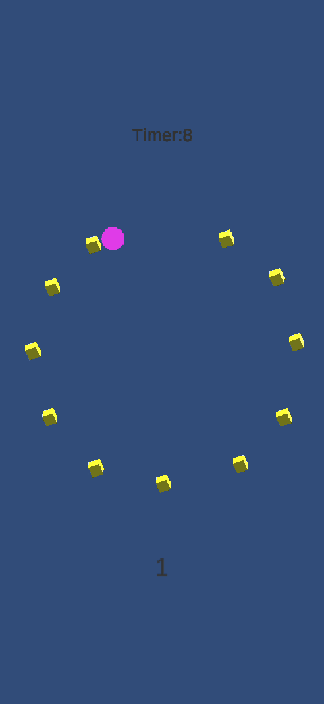
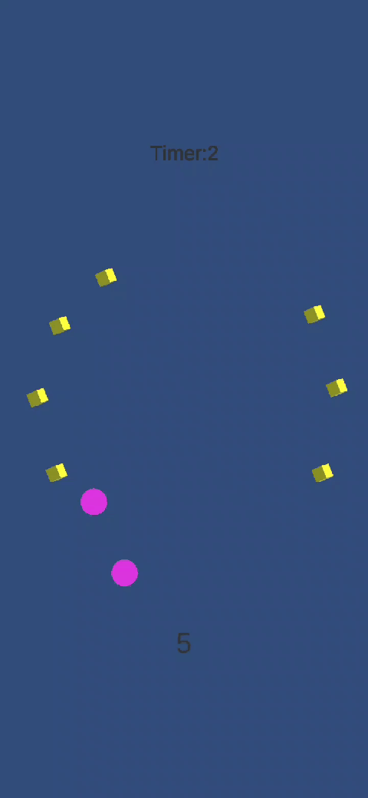

#User Behavior

This project talks about how User data can be saved into to file and use that same data to recreate the path the user took while playing the game.

##Android Version

-The user is given rotating yellow cubes that they are to pickup within a given timelimit by touching them

-If the user picks up all of the objects within the timelimit they "win"

-User touch locations are written to a file on whatever device they are using called "Debug.txt:

-The script uses a reference to a datapoint called "location" which is instantiated every time the player moves 1 unit farther from the previous position.

-Then the position of the location gameObject is stored along with the timestamp in the debug.txt file.

##Example 1: Winning

## Example 2: Losing

